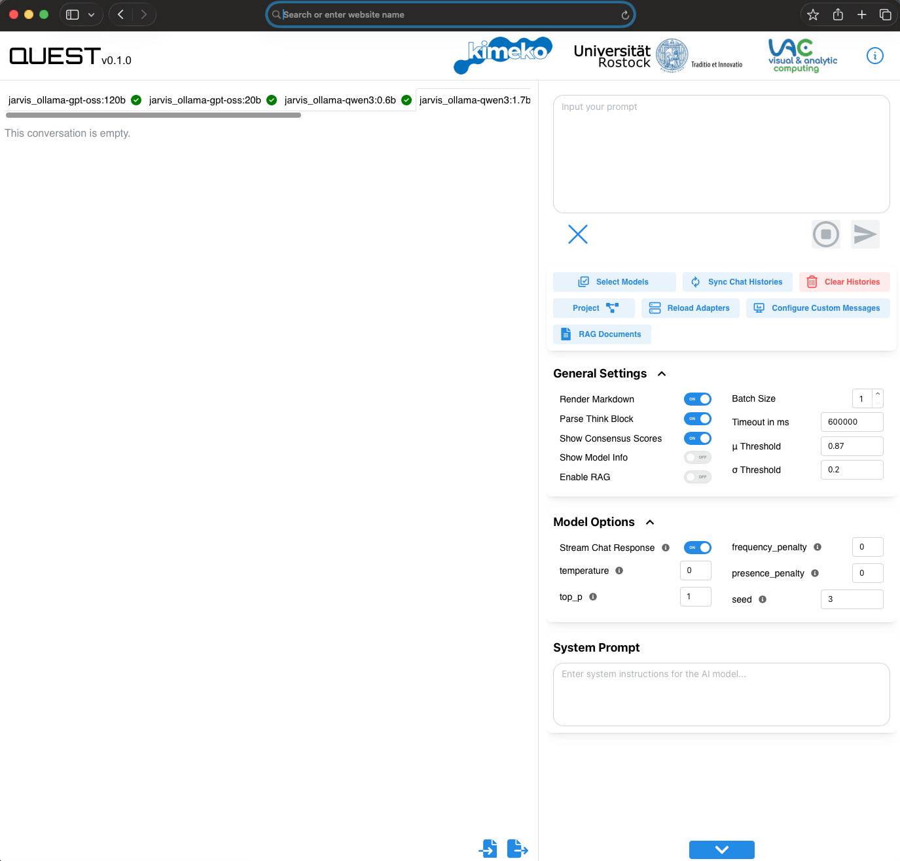
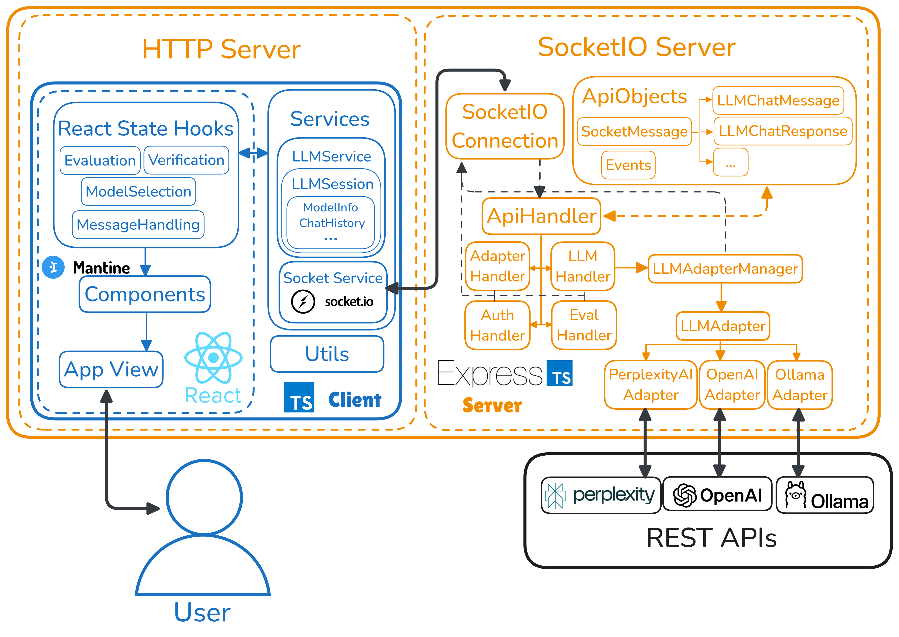

# QUEST (Qualitative Untersuchung und Evaluation von Sprachmodellen Tool)

QUEST is a comprehensive platform for interactive testing, comparison, and evaluation of language models. The application consists of a client-server architecture with support for multiple LLM providers including OpenAI, PerplexityAI and local Ollama models.



## TL;DR Quick Start

```bash
# Server Setup
cd server
cp .env.example .env  # Edit to add your API keys
npm install
npm run dev

# Client Setup (in a different terminal)
cd client
cp .env.example .env  # Edit to set server URL if needed
npm install
npm run dev

# Access at http://localhost:5173
# Default login: user / user
```

## Project Structure

- **Client**: React-based web application for interacting with language models
- **Server**: Node.js backend that handles API requests and manages LLM adapters
- **Python Client**: Python library for programmatic access to the QUEST server

## Architecture



## Installation

Each component has its own installation process, please refer to the respective README files for detailed instructions:

- [Client Guide](client/README.md)
- [Server Guide](server/README.md)
- Python Client Guide

## LLM Adapters

QUEST supports multiple language model providers through a modular adapter system.

### OpenAI Setup

1. Create an OpenAI account and obtain an API key at [https://platform.openai.com](https://platform.openai.com)
2. Add your API key to the server configuration:
   - Option 1: Set it in .env:
     ```
     OPENAI_API_KEY=your_api_key_here
     ```
   - Option 2: Add it directly in config.json under the OpenAI adapter

### Local Ollama Setup

Ollama allows you to run models like Llama locally on your machine.

#### Step 1: Install Ollama

**Windows**:

1. Download and install Ollama from [https://ollama.com/download/windows](https://ollama.com/download/windows)
2. Run the installer and follow the on-screen instructions
3. Ollama will start automatically and be available at http://localhost:11434

**macOS**:

1. Download and install Ollama from [https://ollama.com/download/mac](https://ollama.com/download/mac)
2. Open the downloaded file and drag Ollama to your Applications folder
3. Launch Ollama from the Applications folder

**Linux**:

```sh
curl -fsSL https://ollama.com/install.sh | sh
```

#### Step 2: Pull Models

After installing Ollama, pull the models you want to use:

```sh
# Pull the Llama3 model (8B parameters)
ollama pull llama3

# For a smaller model that runs on less powerful hardware
ollama pull llama3.2:1b

# For other models
ollama pull mistral
ollama pull gemma
```

#### Step 3: Configure QUEST Server

Edit the config.json file to include the Ollama adapter:

```json
"LLMAdapters": {
  "ollama": {
    "baseUrl": "http://localhost:11434",
    "provider": "ollama",
    "modelFilter": [],
    "apiKey": "",
    "maxConcurrentRequests": 1
  }
}
```

### Ollama on a remote GPU host via SSH tunnel

If your Ollama instance runs on a remote machine reachable only via a jump host, use the provided `opentunnel.sh` helper script. Edit the placeholders (`YOUR_JUMP_HOST`, `YOUR_GPU_HOST`, `YOUR_SSH_LOGIN`) at the top of the script for your own infrastructure, then:

```sh
./opentunnel.sh your_login 11435 12346
```

Then configure a QUEST adapter that points at the forwarded local port:

```json
"LLMAdapters": {
  "remote_ollama": {
    "baseUrl": "http://localhost:11435",
    "provider": "ollama",
    "modelFilter": [],
    "apiKey": ""
  }
}
```

## Adapter Configuration

The config.json file contains the configuration for all adapters:

```json
"LLMAdapters": {
  "your_adapter1": {
    "baseUrl": "https://api.openai.com/v1",
    "provider": "openai",
    "modelFilter": ["^gpt-3\\.5.*", "^gpt-4.*"],
    "apiKey": "",
    "maxConcurrentRequests": 3
  },
  "your_adapter2": {
    "baseUrl": "http://localhost:11434",
    "provider": "ollama",
    "modelFilter": [],
    "apiKey": "",
    "maxConcurrentRequests": 1
  }
}
```

Configuration fields:

- `baseUrl`: The API endpoint for the provider
- `provider`: The adapter type ("ollama" or "openai")
- `modelFilter`: Array of regex patterns to filter available models
- `apiKey`: API key for authenticated services (optional for Ollama)
- `maxConcurrentRequests`: Limits simultaneous requests to prevent overloading

**Note:** After changing the configuration, you must either restart the server or use the "Reload Adapters" button in the client UI.

## Production Build & Deployment

To build the application for production:

1. **Build the client**

   ```sh
   cd ../client
   npm run build
   ```

2. **Build the server**

   ```sh
   cd ../server
   npm run build
   ```

   This process will:

   - Compile the TypeScript code
   - Bundle the server application
   - Automatically copy the client dist files to the server's dist/client directory

3. **Start the production server**

   ```sh
   npm run start
   ```

   The server will be available at `http://localhost:3000` (or your configured port)

4. **Deployment to external server**

   Alternatively, you can copy the contents of the `dist` directory to your production server and run:

   ```sh
   node server.bundle.js
   ```

   Ensure that your target server has Node.js installed and any required environment variables set.

## Troubleshooting

### Server Won't Start

- Check that Node.js 18+ is installed
- Verify port 3000 is available
- Look for syntax errors in the config.json file

### Models Not Appearing

- For local Ollama: Ensure the service is running with `ollama serve`
- For OpenAI: Verify your API key is correct
- Check network connectivity to the model provider
- Reload the adapters in the client UI with the button `Reload Backend`

### Slow Performance with Local Models

- Reduce the size of the model (try llama3.2:1b instead of llama3)
- Increase system RAM allocation
- Use GPU acceleration if available

### Error "AbortError: This operation was aborted"

- This typically means the request timed out
- Increase timeout settings in the client UI
- Check network connectivity or model availability

## Additional Resources

- [Client Developer FAQ](client/ClientDeveloperFAQ.md)
- [Server Developer FAQ](server/ServerDeveloperFAQ.md)
- [Detailed Configuration Guide](server/src/file/Configuration.md)
- [Evaluation Metrics](server/src/socket/handlers/Evaluation.md)

## License and Credits

The tool was created by Felix Gratzkowski under the scientific supervision of Dr. rer. nat. Sebastian Bader and Dr.-Ing. Robin Nicolay at the University of Rostock.

This project was developed as part of the KI-Med Collaboration Platform (KiMeKo) project for the comparative analysis of AI models. It is funded by the BMBF (funding code 01IS24056D) and aims to accelerate the development of AI-based medical products. It is part of a northern German ecosystem that brings together research institutions, clinics and companies to drive forward innovative solutions in the field of medical technology.

This work is licensed under the [Creative Commons Attribution-NonCommercial-ShareAlike 4.0 International License (CC BY-NC-SA 4.0)](https://creativecommons.org/licenses/by-nc-sa/4.0/).

You are free to:

- Share — copy and redistribute the material in any medium or format
- Adapt — remix, transform, and build upon the material

Under the following terms:

- Attribution — You must give appropriate credit to the University of Rostock
- NonCommercial — You may not use the material for commercial purposes
- ShareAlike — If you remix, transform, or build upon the material, you must distribute your contributions under the same license


For the full license text, see the [LICENSE](LICENSE) file in the project root.

© 2024 University of Rostock. All rights reserved.

This project is proprietary software developed by the University of Rostock.
